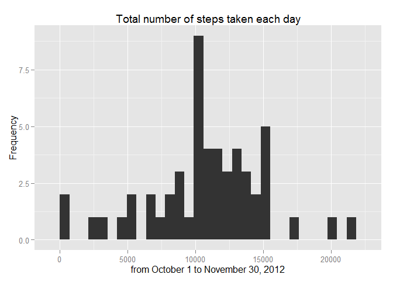
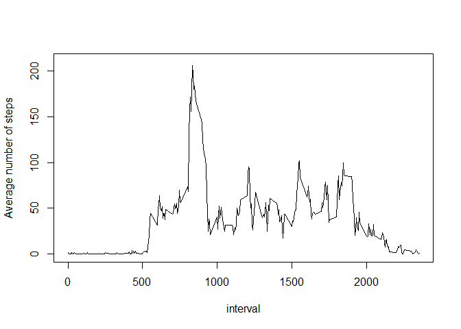
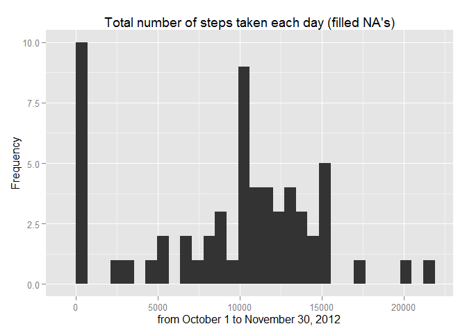
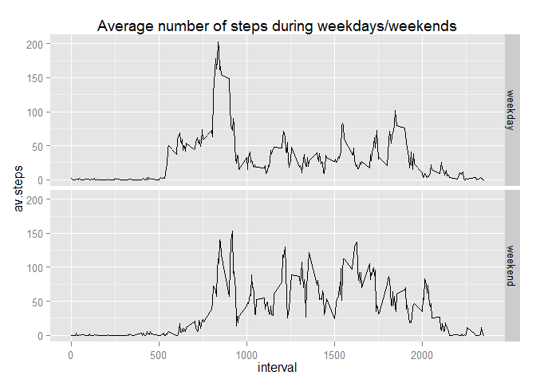

# PA1_template
Andrea Piccioni  
Thursday, January 08, 2015  

The first step in the assignment is to read the .csv file containing the data to be explored


```r
activity <- read.csv("activity.csv")
```

Let's have a look to the dataset


```r
summary(activity)
```

```
##      steps                date          interval     
##  Min.   :  0.00   2012-10-01:  288   Min.   :   0.0  
##  1st Qu.:  0.00   2012-10-02:  288   1st Qu.: 588.8  
##  Median :  0.00   2012-10-03:  288   Median :1177.5  
##  Mean   : 37.38   2012-10-04:  288   Mean   :1177.5  
##  3rd Qu.: 12.00   2012-10-05:  288   3rd Qu.:1766.2  
##  Max.   :806.00   2012-10-06:  288   Max.   :2355.0  
##  NA's   :2304     (Other)   :15840
```

There is 2,304 NA's on 17,568 observations.

**What is mean total number of steps per day?**

First, we want to make a histogram of the total number of steps taken each day. To do that, I am going to use the dplyr package to get the dataset to plot


```r
library(dplyr)
```

```
## 
## Attaching package: 'dplyr'
## 
## The following object is masked from 'package:stats':
## 
##     filter
## 
## The following objects are masked from 'package:base':
## 
##     intersect, setdiff, setequal, union
```

```r
daily_activity <- activity %>%
  group_by(date)%>%
  summarise(daily.steps=sum(steps), na.rm=T)%>%
  select(date,daily.steps)
```

Now I call a histogram using ggplot2

```r
library(ggplot2)
ggplot(daily_activity,aes(daily.steps)) + geom_histogram() + labs(x="from October 1 to November 30, 2012", y="Frequency", title="Total number of steps taken each day")
```

```
## stat_bin: binwidth defaulted to range/30. Use 'binwidth = x' to adjust this.
```

 

We calculate mean ...

```r
daily.mean1 <- mean(daily_activity$daily.steps, na.rm=T)
```

... and median

```r
daily.median1 <- median(daily_activity$daily.steps, na.rm=T)
```

**What is the average daily activity pattern?**

```r
av_activity <- activity %>%
  group_by(interval)%>%
  summarise(average=mean(steps, na.rm=T))%>%
  select(interval, average)
```
and we plot

```r
  plot(av_activity$interval, av_activity$average, type = "l", xlab="interval", ylab="Average number of steps", ylim=c(0,210))
```

 
The maximum number of steps, in average, refers to the following 5 minutes interval

```r
max.interval <- which.max(av_activity$average)
time.interval <- av_activity[max.interval,1]
```
which is the 104th five minutes interval of the day, corresponding to the  8:35-8:40 AM interval.

**Inputting missing values**

We calculate the total number of missing values in the dataset

```r
  missing.values <- is.na(activity$steps)
  table(missing.values)
```

```
## missing.values
## FALSE  TRUE 
## 15264  2304
```
Assuming that the NA's correspond to periods of inactivity, we replace the missing values with zero's

```r
activity[is.na(activity)] <- 0 
```

Then, we want to get a histogram of the total number of steps taken each day. 


```r
daily_activity2 <- activity %>%
  group_by(date)%>%
  summarise(daily.steps=sum(steps), na.rm=T)%>%
  select(date,daily.steps)
ggplot(daily_activity2,aes(daily.steps)) + geom_histogram() + labs(x="from October 1 to November 30, 2012", y="Frequency", title="Total number of steps taken each day (filled NA's)")
```

```
## stat_bin: binwidth defaulted to range/30. Use 'binwidth = x' to adjust this.
```

 

We calculate the mean ...

```r
daily.mean2 <- mean(daily_activity2$daily.steps, na.rm=T)
```

... and the median

```r
daily.median2 <- median(daily_activity2$daily.steps, na.rm=T)
```
and we compare them to the former ones. The replacement of missing values with '0' results in reduced mean and median, of course.

```r
diff.mean <- daily.mean2 - daily.mean1 
diff.mean
```

```
## [1] -1411.959
```

```r
diff.median <- daily.median2 - daily.median1
diff.median
```

```
## [1] -370
```


**Are there differences in activity patterns between weekdays and weekends?**

We add a column containing the factor variable weekday/weekend

```r
activity$day <- weekdays(as.Date(activity$date)) == "Saturday" | weekdays(as.Date(activity$date)) == "Sunday"
activity$day <- factor(activity$day, levels = c(F, T), labels = c("weekday", "weekend"))
```
I use ggplot2 to create a panel plot displaying the different pattern between weekdays and weekends

```r
daily_activity3 <- activity %>%
  group_by(interval, day)%>%
  summarise(av.steps=mean(steps), na.rm=T)%>%
  select(interval:av.steps)
ggplot(daily_activity3, aes(interval,av.steps)) + geom_line() + facet_grid (day~.) + ggtitle("Average number of steps during weekdays/weekends")
```

 
